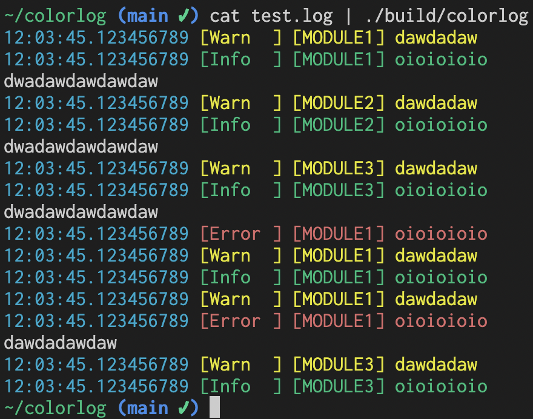

# Colorlog



## Building

```shell
rm -rf build-release
cmake -S . -B build-release -D CMAKE_BUILD_TYPE=Release
cmake --build build-release
```

## Developing

```shell
rm -rf build-debug
cmake -S . -B build-debug -D CMAKE_BUILD_TYPE=Debug
tput reset && cmake --build build-debug && cat test.log | ./build-debug/colorlog
```
